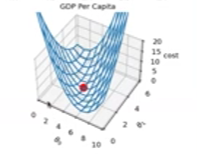
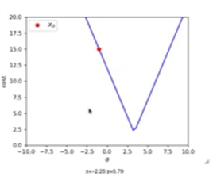
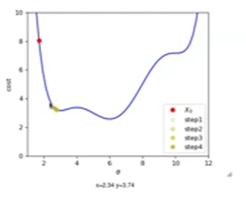

# Day 1.1

## random thoughts
- data => learn sth from it => ml
- supervised => specific target/lbl
  - regression: predict continuous number
  - classification: label each sample to specific class
- unsupervised => detect some pattern in the data
- model selection: 
  - linear: linear data
- model parameters
- performance measure
  - RMSE
  
## structured notes

### Supervised learning
#### Linear regression:
1. model = sum(features * weights)
  - (x0 -bias-)+ x1 * w1 + ....
  - data has noise => set system to learn from signals and ignore noise.
2. Performance measure:
  - RMSE: same as mse, same min as it's ^2 only.
  - MSE: easier mathematically, integrationally, etc
  - sometimes => sometimes we optimize function different from our performance measurement
  1. MSE
     1. min cost 
      - try random weights till the model represent the data well
      - graph w0 with cost func, w1 with cost func => each seperately, won't work => gotta min both x0,x1 with cost func at same time! (some 3D  axis).
      - 
     2. Gradient Descent
     - automate the parameters tuning to min cost function 
     - get slope of func(change in cost / change in x) => if i moved in that direction, how much cost func would change? => min: slope=0
     - if lr incrreased: overshoot-arrives, extra increased: diverge-won't arrive.
  2. MAE/L1:
     1. 
     2. gradient stable, no grade
     3. non-differentiable at min
     4. obsolation? => dynamic lr
     5. dynamic lr: as gradient is stable, won't change, it was lr*grade => change the lr then! (lr schedulling).
  3. other cost func:
     1. 
     2. if too close: can stuck in local minima
     3. if too far: can stop at saddle points.